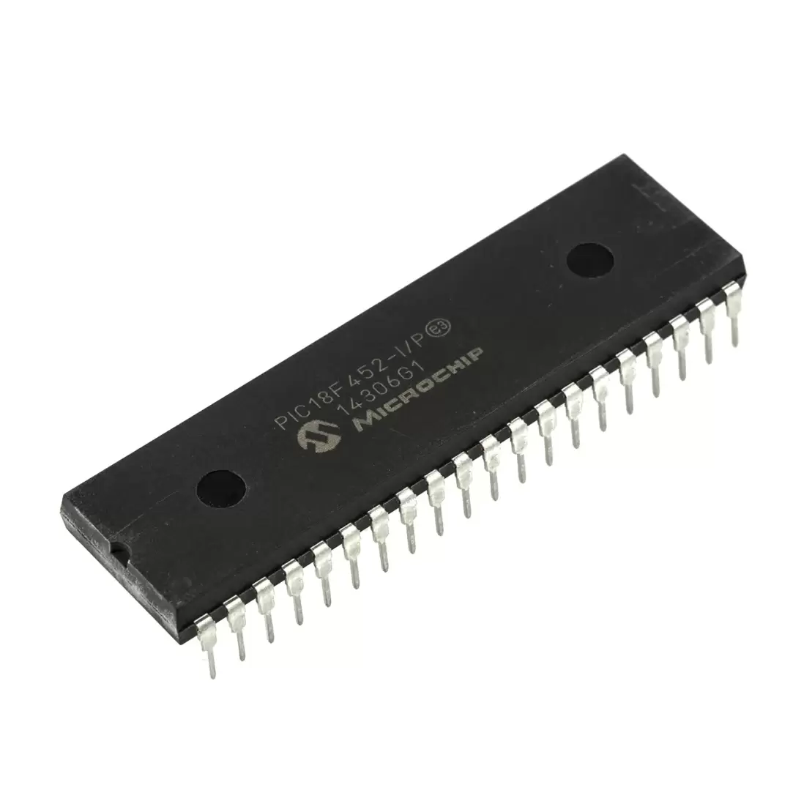


# PIC_project
### About
This is an interfacing project on the PIC18F452 device with the aim to integrate various hardware devices.\
The project is for learning purposes, so updates are continuous.
### Building
-Navigate to the base directory  
-Run `make build`  
-The built files (including the .hex file) are found in `/dist/default/production/interfacing_main.X.production.hex`
### Available devices
Basic general devices include LEDs, push buttons, relays, 7 segment displays, DC motors, LCDs, and keypads.
